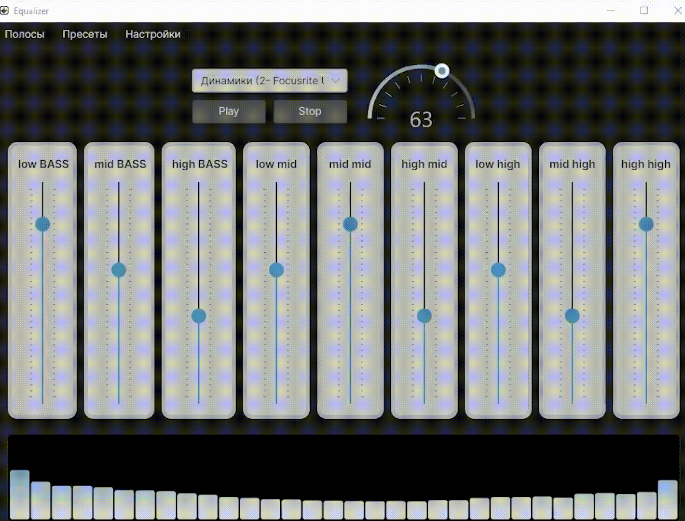
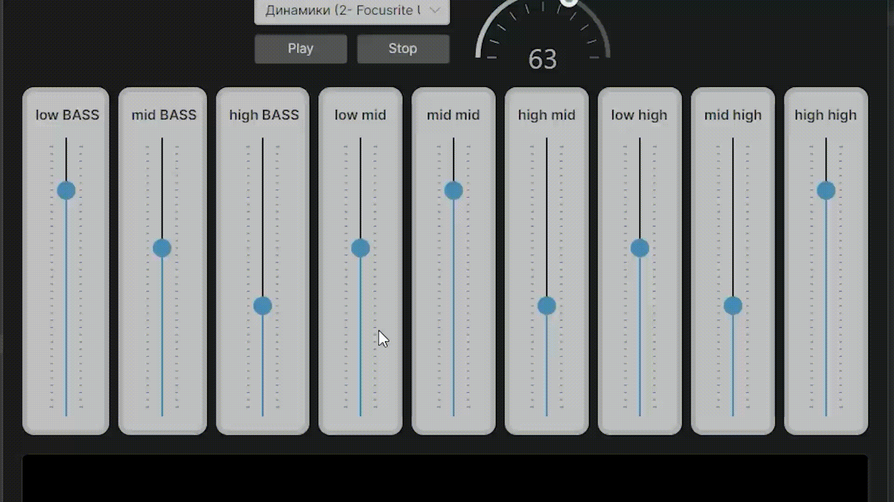
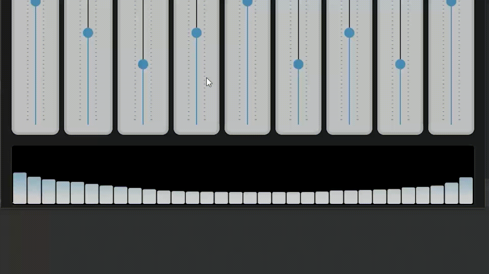

# Equalizer 🎚️

Графический эквалайзер написанный на Avalonia для визуального отображения звуковой кривой и регулировки полос частот.

---

## 🛠 Основные возможности

- Графический интерфейс с управлением кривой эквалайзера

- Регулировка уровня нескольких полос (gain, частота, Q)  

- Отображение отклика в реальном времени  

- Добавление своих полос

- Удаление своих полос

- Сохранение пресетов

- Загрузка пресетов

- Изменение устройства захвата, анимации спектра и загрузки дефолтного пресета при запуске

---

## 🚀 Начало работы
Для работы приложения необходимо устройства для захвата звука, в идеале небоходимо установить VAC (Virtial Audio Cabel), но можно и использовать неиспользуемое для вывода устройство.
В релизах всегда 2 rar архива, один архив для работы приложения требует установленного .net 8 окружения, второй же билд автономный, все необходимое окружение запаковано в pe файле (exe)
